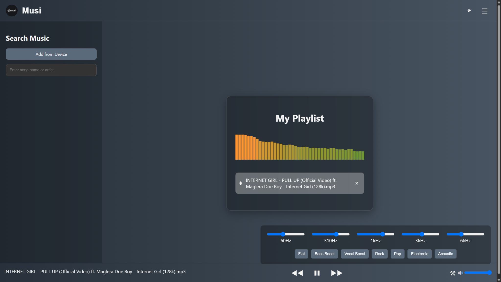
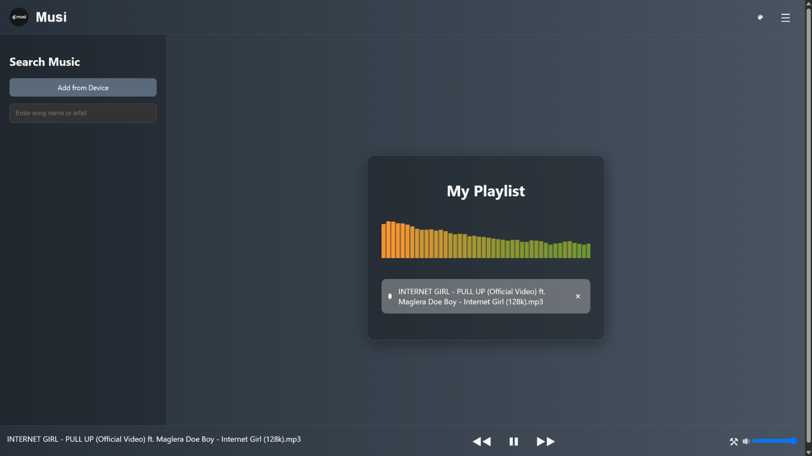
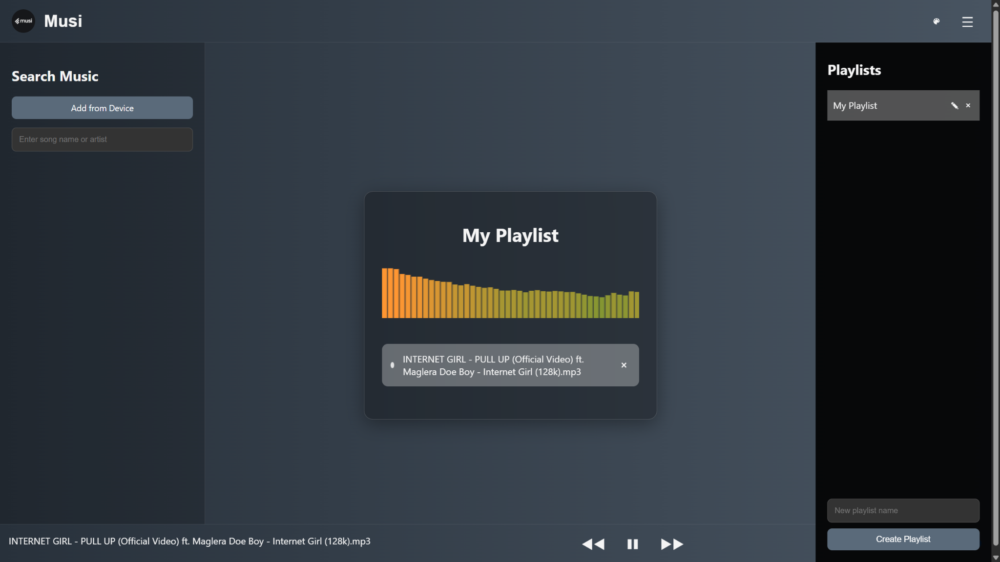
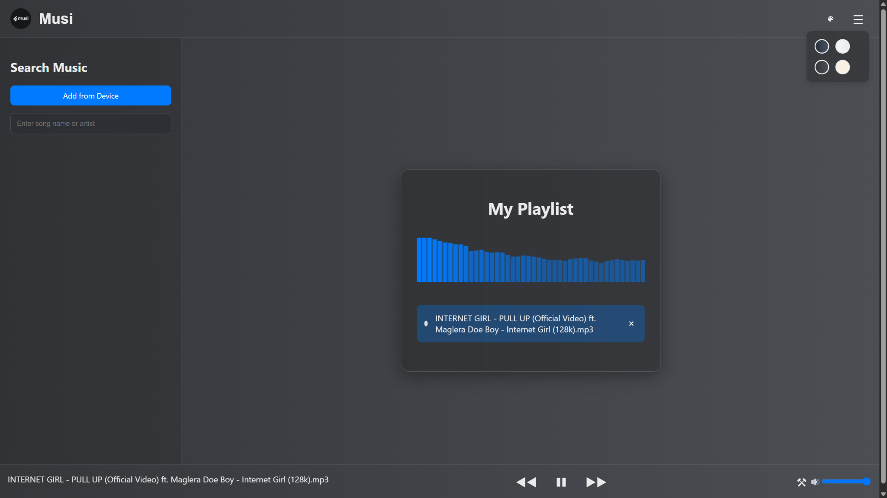
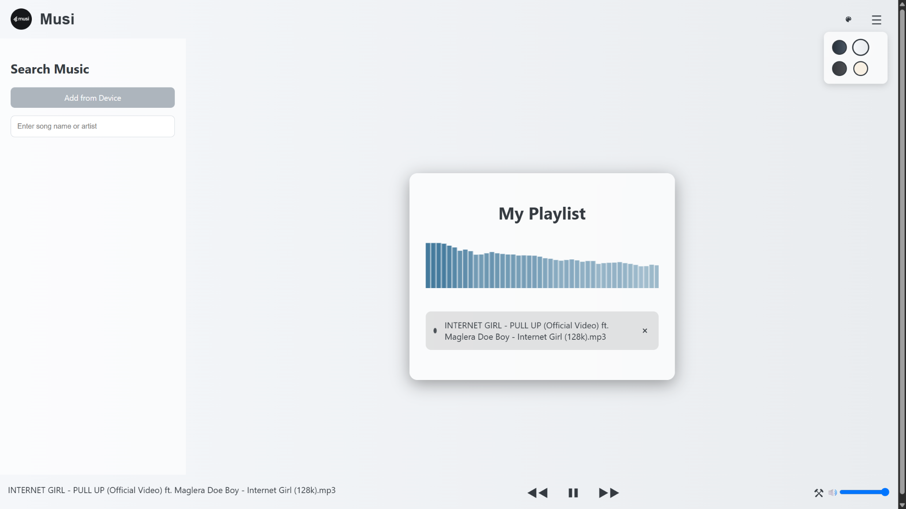

# 🎵 Musi

A modern, responsive music streaming web application with an elegant interface and seamless listening experience.

## 🌐 Live Demo

👉 https://musi-6ak0.onrender.com/

---

## Features

- 🎧 Music Search
- ▶️ Audio Playback
- 📂 Playlist Management
- 🎚️ Built-in Equalizer
- 🎨 Multiple Themes
- 📱 Fully Responsive Design

## Tech Stack

- HTML
- CSS
- JavaScript
- iTunes Search API

## Installation

```bash
git clone https://github.com/Gautkk30/Musi.git
cd Musi
```

Open `index.html` or run using Live Server.

---

---

# 📸 Screenshots

<p align="center">
  
</p>

<p align="center">
  
  
</p>

<p align="center">
  
  
</p>

## Future Improvements

- User Authentication
- Favorite Songs
- Lyrics Support
- Offline Playback
- PWA Support
